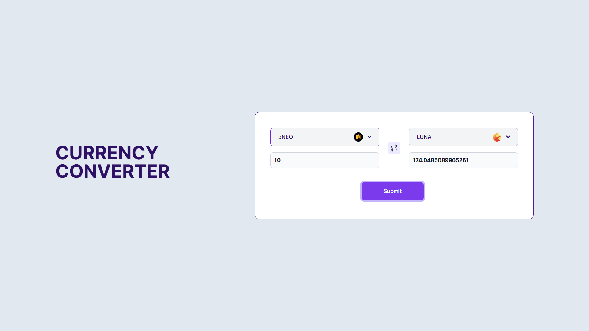
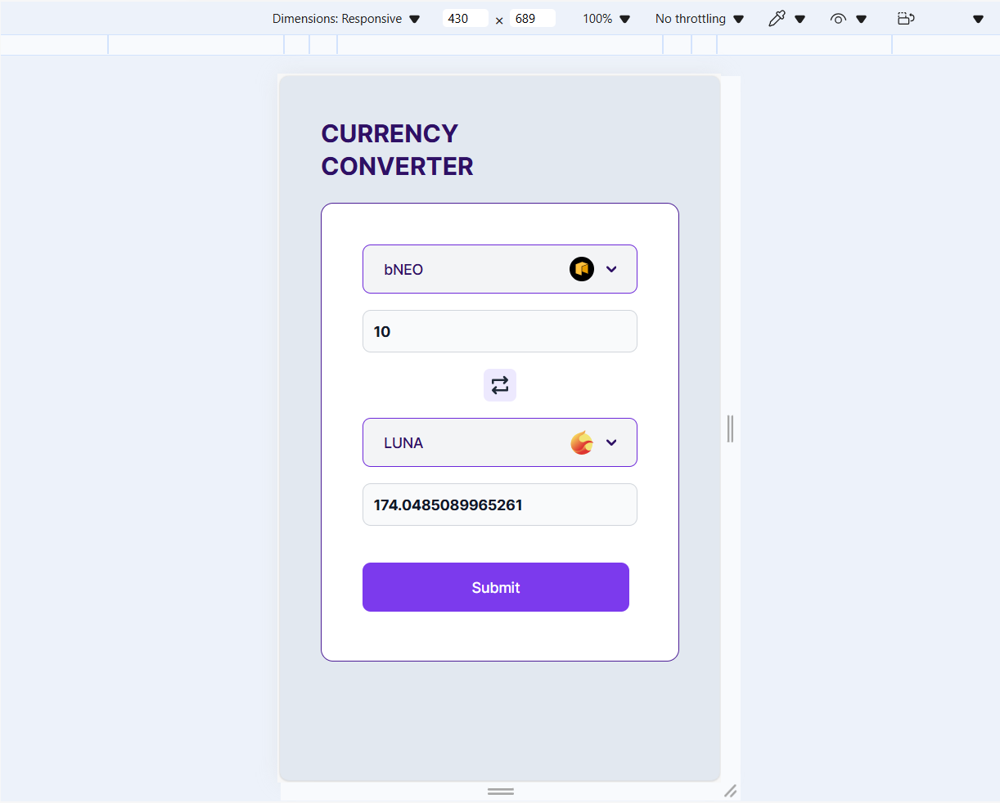
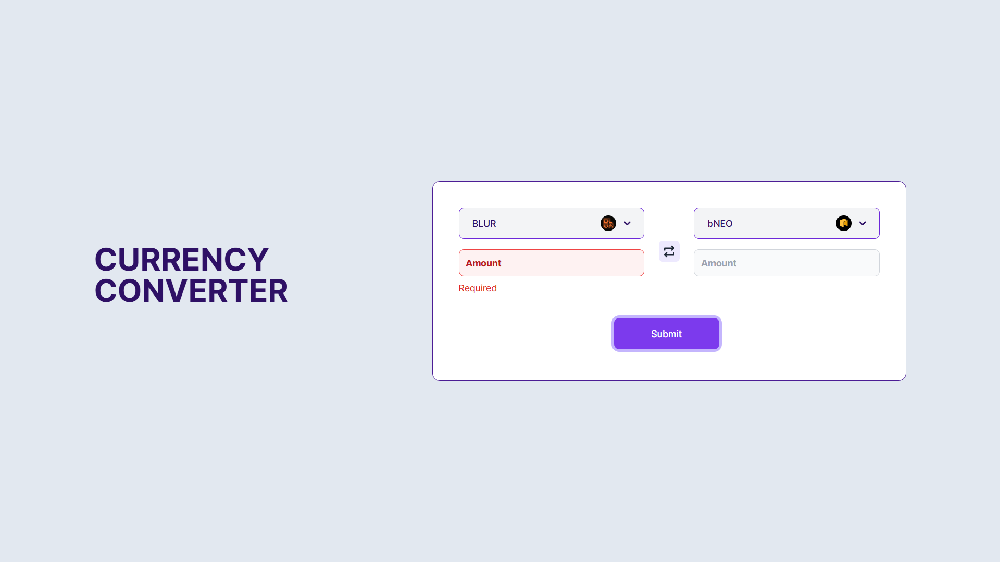
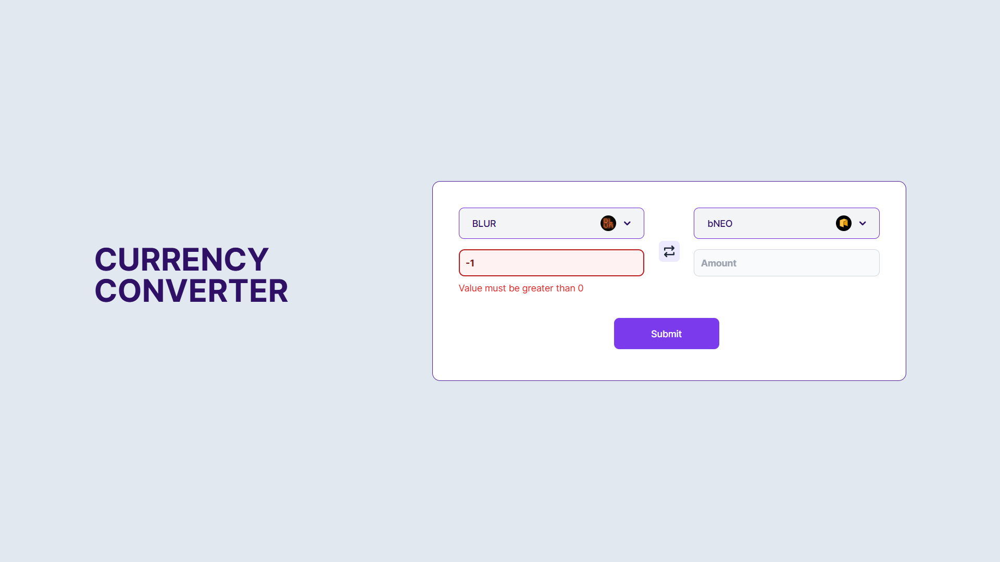

# Info

- Author: Pham Quoc Cuong
- Problem 2 for **99Tech** challenge

# Tech

- React + tailwindCss for UI
- Yup + formik for form validation

# Run this project

- Please run the following cmd

```
cd ./src/problem2
npm i
npm run dev
```

# Test Result

## UI

**Desktop UI**



**Mobile UI**



## Form validation

**Required when submit**



**Must greater than 0**



**Must be a number**


